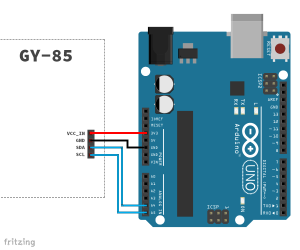

# GY-85

Technical documentation for GY-85 (ADXL345 accelerometer, ITG3200 gyroscope and HMC5883L magnetometer).
The code shown below can be seen as [pseudocode](https://en.wikipedia.org/wiki/Pseudocode), implementations for Arduino and Processing are in the making at the moment.

- [Theory](#theory)
  - [Accelerometer (ADXL345)](#accelerometer-adxl345)
    - [Links](#links)
  - [Gyroscope (ITG3200)](#gyroscope-itg3200)
    - [Links](#links-1)
  - [Magnetometer (HMC5883L)](#magnetometer-hmc5883l)
    - [Links](#links-2)
- [Hardware](#hardware)
  - [Wiring](#wiring)
- [Guides and further reading](#guides-and-further-reading)

## Theory

> An inertial measurement unit (IMU) is an electronic device that measures and reports a craft's velocity, orientation, and gravitational forces, using a combination of accelerometers and gyroscopes, sometimes also magnetometers.

*[Inertial measurement unit](http://en.wikipedia.org/wiki/Inertial_measurement_unit)* on Wikipedia, the free encyclopedia.

The GY-85 contains three microcontroller, measuring acceleration, orientation and Earth's magnetic field. Values can be gathered using the I2C protocol. The X-axis and the Y-axis are horizontal and the Z-axis is vertical.

[IMG]

Rotations around the axis will be named after the [aircraft principal axes](http://en.wikipedia.org/wiki/Aircraft_principal_axes). Therefor a rotation about the X-axis is called "roll", a rotation about the Y-axis "pitch" and about the Z-axis "yaw".

[IMG]

### Accelerometer (ADXL345)

> An accelerometer is a device that measures proper acceleration ("g-force"). Proper acceleration is not the same as coordinate acceleration (rate of change of velocity). For example, an accelerometer at rest on the surface of the Earth will measure an acceleration g= 9.81 m/s2 straight upwards. By contrast, accelerometers in free fall orbiting and accelerating due to the gravity of Earth will measure zero.

*[Accelerometer](http://en.wikipedia.org/wiki/Accelerometer)* on Wikipedia, the free encyclopedia.

Thing with an accelerometer is, it is quite precise and does not drift, but it is impossible to measure changes about the Y axis. Simply put, that happens, because the gravity force does not change during a vertical rotation.

The accelerometer used on the GY-85 is the ADXL345 from Analog Devices. It measures acceleration for all three axis (x, y, z) and has a resolution up to 13 bit (detects changes less than 1.0°). The ADXL345 also has some nice extra features like tap and double tab detection, that can be used to trigger an interrupt on the Arduino.

Although it comes with a pretty good calibration, it is possible to calculate new values for calibrations and store them in the chip. These will automatically applied to all future measurements. The most common way to calibrate an accelerometer is to take a couple of measurements in idle state and calculate the average.

The chip usually returns digitalized sensor values with a resolution of 10 bit. To be able to further work with this data, the values have to be converted to a common unit like G.

    Value in G = Measurement Value * (G-range/(2^Resolution))

The G-range and Resolution used in this formula depends of the configuration of the chip. The ADXL345 supports the ranges ±2g/±4g/±8g/±16g. As Resolution, 10 or 13 bit can be set. Measurement Value is simple the raw value, read from the chip for one axis.
If the ADXL345 is used with the default settings, a resolution of 10 bit and a range of ±2g(=a range of 4g), the following formula can be used:

    Value in G = Measurement Value * (4/(2^10)) = Measurement Value * (4/1024) = Measurement Value * (1/256) = Measurement Value * 0.0039

This calculation must be done for each axis separately. The resulting values are expected to be within ±1g.

    xg = valX * 0.0039;
    yg = valY * 0.0039;
    zg = valZ * 0.0039;

These measurements are a bit jumpy and can further be improved by filtering them. An example for a low pass filter can be found [here](http://theccontinuum.com/2012/09/24/arduino-imu-pitch-roll-from-accelerometer/).

    fXg = xg * alpha + fXg * (1.0 - alpha);
    fYg = yg * alpha + fYg * (1.0 - alpha);
    fZg = zg * alpha + fZg * (1.0 - alpha);

Having calculated the x, y and z values in g, these can be used to further calculate the angles. Based on the [aircraft principal axes](https://en.wikipedia.org/wiki/Aircraft_principal_axes), the rotation about the X-axis is called roll, the rotation about the Y-axis is called pitch. Additional the rotation about the Z-axis would be called yaw, but an 3-axis accelerometer is not able to measure it, as the force vector of gravity does not change during the movement.

	Roll = atan2(yg, zg) * 180/PI;
	Pitch = atan2(-xg, sqrt(yg*yg + zg*zg)) * 180/PI;

The formulas have been pointed out by a [StackOverflow user](http://stackoverflow.com/a/10320532/709769) in reference to [this document](http://www.freescale.com/files/sensors/doc/app_note/AN3461.pdf).

#### Links

- [Product page: ADXL345](http://www.analog.com/en/mems-sensors/mems-inertial-sensors/adxl345/products/product.html)
- [Datasheet: ADXL345 accelerometer, Ref D](http://www.analog.com/static/imported-files/data_sheets/ADXL345.pdf)

### Gyroscope (ITG3200)

> A gyroscope [...] is a device for measuring or maintaining orientation, based on the principles of angular momentum.

*[Gyroscope](http://en.wikipedia.org/wiki/Gyroscope)* on Wikipedia, the free encyclopedia.

The GY-85 uses InvenSense's ITG3200 to measure orientation. It can sense motion on all three axis and the sensor values are digitalized using a 16 bit ADC. In addition is also has an integrated temperature sensor.

It is necessary to divide the measured value by the "Sensitivity Scale Factor" to get the value in degree per second. This "Sensitivity Scale Factor" can be found the the datasheet.

    Value in °/s = Measurement Value / Sensitivity Scale Factor

The "Sensitivity Scale Factor" is a constant and given with 14.375 LSB pro °/s.

    Value in °/s = Measurement Value / 14.375

This has to be applied to all axes separately. The resulting values are expected in between ±2000°/s.  

    xds = valX / 14.375;
    yds = valY / 14.375;
    zds = valZ / 14.375;

// Angle

    Angle += Value in °/s * Delta Time in Seconds

    Roll += valX * dtime * 0.001;
    Pitch += valY * dtime * 0.001;
    Yaw += valZ * dtime * -0.001;

Trying to read the temperature from the chip only returns a huge integer. A constants to convert the sensor readings into degree celsius can be found in the datasheet on page 7. A value of -13200 represents 35° celsius, every 280 from there is another degree celsius. Therefor the following formula can be applied:

    Temperature in °C = 35 + (Measurement Value + 13200)/280;

#### Links

- [Product page: ITG3200](http://www.invensense.com/mems/gyro/itg3200.html)
- [Datasheet: ITG3200 gyroscope, Rev. 1.4](https://www.sparkfun.com/datasheets/Sensors/Gyro/PS-ITG-3200-00-01.4.pdf)

### Magnetometer (HMC5883L)

> Magnetometers are measurement instruments used for two general purposes: to measure the magnetization of a magnetic material like a ferromagnet, or to measure the strength and, in some cases, the direction of the magnetic field at a point in space.

*[Magnetometer](http://en.wikipedia.org/wiki/Magnetometer)* on Wikipedia, the free encyclopedia.

Honeywell's HMC5883L is a 3-axis digital magnetometer. The chip is most commonly used as a digital compass to sense the angle from magnetic north (not [true north](http://en.wikipedia.org/wiki/True_north)) in degrees.

// multiplicator = Gain, Digital Resolution (mG/LSb) for ± 1.3 Ga (see datasheet p. 13)

	mx = valX * 0.92;
	my = valY * 0.92;
	mz = valZ * 0.92;

To now get the heading, arctangent is used.

    Heading = atan2(my, mx);

Magnetic declination is the deviation between the measured magnetic north and the true north. Depending on the position on the planet, magnetic declination differs. Luckily, there are [websites](http://www.magnetic-declination.com), that help to determine this value.

Taken for my current position, [Graz/Austria](http://www.magnetic-declination.com/Austria/Graz/102700.html), the magnetic declination angle is +3.87°. Once knowing this value the rest is easy, we convert this value in rad and add it to our heading.

    Declination = +3.87 * PI/180 = 0.067544242052;
    Heading += Declination;

Now we correct for when signs are reversed..

    if (Heading < 0)
        Heading += 2*PI;

..and due to the addition of the declination.

    if (Heading > 2*PI)
        Heading -= 2*PI;

Finally we convert our value to °.

    Heading in ° = Heading * 180/PI;

#### Links

- [Datasheet: HMC5883L magnetometer](http://dlnmh9ip6v2uc.cloudfront.net/datasheets/Sensors/Magneto/HMC5883L-FDS.pdf)

### Aligning the axes

tba.

### Stabilizing the results

To get the most stable results, it makes sense to combine the data, measured by the three chips.

tba.

// http://forums.parallax.com/showthread.php/152502-Tilt-Compensation-Magnetometer-%28-HMC5883L%29
// http://theboredengineers.com/2012/09/the-quadcopter-get-its-orientation-from-sensors/

## Hardware

### Wiring

## Guides and further reading

The following list contains articles and other resources, that help to understand the basic principals of the technology used on the GY-85.

- [A Guide To using IMU (Accelerometer and Gyroscope Devices) in Embedded Applications.](http://www.starlino.com/imu_guide.html)
- [Tilt Sensing Using a Three-Axis Accelerometer](http://www.freescale.com/files/sensors/doc/app_note/AN3461.pdf)

- [Sparkfun: ADXL345 Quickstart Guide](https://www.sparkfun.com/tutorials/240)
- [My first 6 DOF IMU Sensors Fusion Implementation: ADXL345, ITG3200, Arduino and Processing](http://www.varesano.net/blog/fabio/my-first-6-dof-imu-sensors-fusion-implementation-adxl345-itg3200-arduino-and-processing)
- [Arduino: simple compass with HMC5883L + Library](http://bluelemonlabs.blogspot.co.at/2013/08/arduino-simple-compass-with-hmc5883l.html)
- [HMC5883L Three-Axis Compass Magneticfield Module](http://www.electrodragon.com/w/index.php?title=HMC5883L_Three-Axis_Compass_Magneticfield_Module)
- [Arduino and HMC5883L (With Auto Calibration)](http://hobbylogs.me.pn/?p=17)
- [A practical approach to Kalman filter and how to implement it](http://blog.tkjelectronics.dk/2012/09/a-practical-approach-to-kalman-filter-and-how-to-implement-it/)
